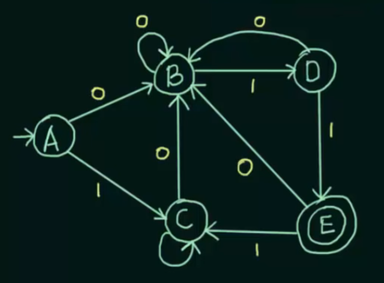
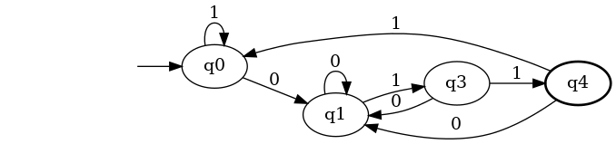
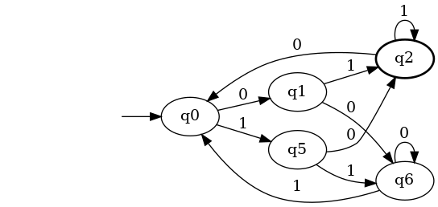

# sbc.c || sbc.h

SBC significa "States by class", por que es la estructura que se encarga de separar los estados por clase.

Estructura:
1. **data**: contiene varias listas de estados (cada estado es un int)
2. **num_states**: lleva la cuenta de cuantos estados hay en cada lista de *data*
3. **total_classes**: lleva la cuenta de cuantas clases hay en este SBC

Funciones publicas:
1. **print_sbc**: para usar haciendo debug
2. **add_class_sbc**: reserva memoria para una nueva clase y la mete al final de *data*.
3. **remove_class_sbc**: primero hace un swap de la clase que queremos borrar con la ultima clase de *data*. Una vez hecho el swap se borra la clase, que ahora esta en ultima posicion. Esto es para no tener que mover nada mas que una lista de *data*.
4. **get_class_sbc**: dado un estado, devuelve el indice de la clase en la que se encuentra el estado. Esto es util para comprobar si dos estados estan en la misma clase.
5. **add_state_sbc**: reserva memoria y mete un nuevo estado en la ultima posicion de la clase que nos pasan por parametros.
6. **remove_state_sbc**: igual que al borrar una clase, primero hacemos un swap con el ultimo estado y luego lo borramos para no reordenar la lista de estados.
7. **free_sbc**: libera la memoria del SBC.
8. **create_sbc**: crea un nuevo SBC y mete una clase.

Funciones privadas:
1. **swap_class**: usado en remove_class_sbc para intercambiar la posicion de dos clases. Tambien intercambia los contadores de las listas (que se encuentran en num_states dentro de la estructura SBC) para mantener la coherencia.
2. **swap_state**: usado en remove_state_sbc para intercambiar la posicion de dos estados.

# minimiza.c || minimiza.h

Equivalente a transforma. Tiene una sola funcion publica que dado un automata te devuelve el minimizado. Dentro tiene multiples funciones privadas para separar la funcionalidad.

Funciones privadas:
1. **get_transition_class**: dado un estado y un simbolo, calcula el estado siguiente. Luego devuleve la clase del estado siguiente. Esto resulta util en check_class para saber si dos estados son equivalentes o no.
2. **check_class**: dados dos estados, comprueba si son equivalentes. Para comprobar esto, calcula si la clase de las transiciones coincide siempre (como esta en la presentacion).
3. **divide_class**: dado un SBC y el indice de una clase, divide esta clase en las subdivisiones que haga falta. La funcion crea una nueva clase por cada estado y va metiendo en ella todos los estados equivalentes. Para evitar repetir estados, guarda en done_states todos los que ya se han guardado.
4. **divide_final**: dado un SBC, divide los estados en finales y no finales. Para ello, inserta todos los no finales en la clase cero y los finales en una nueva clase (la clase uno).

Funciones publicas:
1. **AFNDMinimiza**: dado un automata devuelve el minimizado.

# Resultados de los tests

## Test 0
Original

Esperado

Resultado

## Test 1
Original

Esperado

Resultado

## Test 2
Original

Esperado

Resultado

